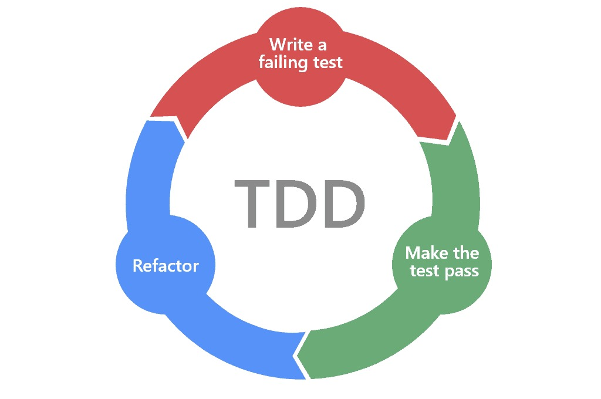

## Description

This project  aim to learn nest, and apply TDD principles along the way.



Thoses TDD principles will be respected :

1. You are not allowed to write any production code until you have first written a failing unit test.
2. You are not allowed to write more of a unit test than is sufficient to fail — and not compiling is failing.
3. You are not allowed to write more production code that is sufficient to pass the currently failing unit test

## Installation

```bash
$ npm install
```

## Running the app

```bash
# development
$ npm run start

# watch mode
$ npm run start:dev

# production mode
$ npm run start:prod
```

## Test

```bash
# unit tests
$ npm run test

# e2e tests
$ npm run test:e2e

# test coverage
$ npm run test:cov
```

## Support

Nest is an MIT-licensed open source project. It can grow thanks to the sponsors and support by the amazing backers. If you'd like to join them, please [read more here](https://docs.nestjs.com/support).

## Stay in touch

- Author - [Kamil Myśliwiec](https://kamilmysliwiec.com)
- Website - [https://nestjs.com](https://nestjs.com/)
- Twitter - [@nestframework](https://twitter.com/nestframework)

## License

Nest is [MIT licensed](LICENSE).
